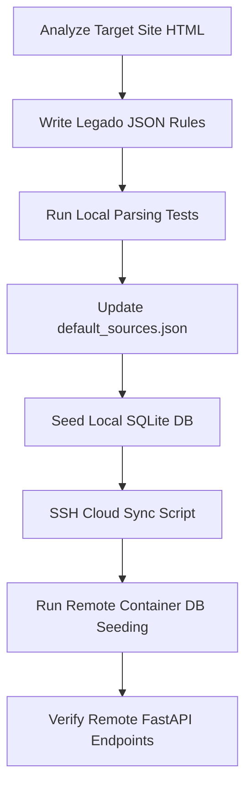

# Legado Book Source Creation & Sync Skill

This skill provides comprehensive instructions, patterns, and reference implementations for creating Legado-compatible book source rules, parsing DOM pages using `LegadoParserEngine`, seeding local and remote databases, and verifying API functionality end-to-end.

---

## 📋 Architectural Workflow



---

## 🛠️ Legado JSON Source Specification

A standard book source is represented as a JSON object inside the `book_source_rules` database table. Below is the full configuration schema:

```json
{
  "bookSourceComment": "Optional commentary",
  "bookSourceGroup": "Category group (e.g., Verified)",
  "bookSourceName": "Source Title (e.g., 爱丽丝书屋)",
  "bookSourceType": 0,
  "bookSourceUrl": "https://www.example.com",
  "customOrder": 1,
  "enabled": true,
  "enabledCookieJar": true,
  "enabledExplore": true,
  "exploreUrl": "Category1::https://www.example.com/lists/1.html?page={{page}}\nCategory2::https://www.example.com/lists/2.html?page={{page}}",
  "lastUpdateTime": 1780910000000,
  "respondTime": 1000,
  "ruleBookInfo": {
    "author": "class.novel_info@tag.p.0@tag.a@text",
    "coverUrl": "class.pic@tag.img@src",
    "intro": "class.jianjie@tag.p@text",
    "kind": "class.novel_info@tag.p.1@tag.a@text&&class.tags_list@tag.a@text",
    "name": "class.novel_title@text",
    "tocUrl": "text.查看所有章节@href"
  },
  "ruleContent": {
    "content": ".read-content@text"
  },
  "ruleExplore": {
    "author": "li.four@text",
    "bookList": ".rec_rullist ul",
    "bookUrl": "li.two a@href",
    "kind": "li.sev a@text, li.five@text, li.six@text",
    "name": "li.two a@text"
  },
  "ruleSearch": {
    "author": "p.mb-1 a@text",
    "bookList": ".list-group-item",
    "bookUrl": "h5 a@href",
    "intro": "p.content-txt@text",
    "kind": "p.text-muted.1 a@text, small.text-muted@text",
    "name": "h5 a@text##^\\d+\\.\\s*##"
  },
  "ruleToc": {
    "chapterList": ".mulu_list li",
    "chapterName": "a@text",
    "chapterUrl": "a@href"
  },
  "searchUrl": "https://www.example.com/search.html?q={{key}}&f=_all",
  "weight": 0
}
```

### ⚠️ Legado Jsoup Parsing Quirks & Solutions
1. **Indexed Selectors**: The python Jsoup parser (`LegadoParserEngine`) struggles with standard css index notations (like `.novel_info p.0` where it interprets `.0` as a class selector).
   * **Fix**: Use tag indexing with `@` separation: `class.novel_info@tag.p.0@tag.a@text`.
2. **Text Content Selectors**: To select elements containing specific text (e.g. catalog link), use the `text.` prefix: `text.查看所有章节@href`.
3. **Regular Expression Replacements**: Strip prefix number indexing in lists using `##` format: `h5 a@text##^\d+\.\s*##`.

---

## 💾 Seeding Database

The database primary keys (`id`) are generated using an MD5 hash of the source name and URL:
$$\text{id} = \text{MD5}(\text{bookSourceName} + "|" + \text{bookSourceUrl})$$

### 1. Local SQLite Seeding Script
```python
import sqlite3
import json
import hashlib

def seed_local_db(db_path, source_dict):
    name = source_dict["bookSourceName"]
    url = source_dict["bookSourceUrl"]
    search_url = source_dict["searchUrl"]
    rule_json = json.dumps(source_dict, ensure_ascii=False)
    id_hash = hashlib.md5(f"{name}|{url}".encode("utf-8")).hexdigest()

    conn = sqlite3.connect(db_path)
    cursor = conn.cursor()
    cursor.execute("SELECT id FROM book_source_rules WHERE id = ?", (id_hash,))
    if cursor.fetchone():
        cursor.execute("""
            UPDATE book_source_rules
            SET source_name = ?, source_url = ?, search_url = ?, rule_json = ?, is_active = 1, is_valid = 1
            WHERE id = ?
        """, (name, url, search_url, rule_json, id_hash))
    else:
        cursor.execute("""
            INSERT INTO book_source_rules (id, source_name, source_url, search_url, rule_json, is_active, is_valid, is_private, is_abyss, last_checked_at)
            VALUES (?, ?, ?, ?, ?, 1, 1, 0, 0, datetime('now'))
        """, (id_hash, name, url, search_url, rule_json))
    conn.commit()
    conn.close()
```

### 2. Cloud PostgreSQL Seeding & Sync (SSH + Docker)
Always encode files as `utf-8` and write in binary (`"wb"`) mode when communicating over SFTP to prevent Windows system encodings (like GBK) from corrupting remote databases.

```python
import paramiko
import json
import hashlib

def sync_to_cloud(host, port, username, password, source_dict):
    name = source_dict["bookSourceName"]
    url = source_dict["bookSourceUrl"]
    search_url = source_dict["searchUrl"]
    rule_json = json.dumps(source_dict, ensure_ascii=False)
    id_hash = hashlib.md5(f"{name}|{url}".encode("utf-8")).hexdigest()

    ssh = paramiko.SSHClient()
    ssh.set_missing_host_key_policy(paramiko.AutoAddPolicy())
    ssh.connect(host, port, username, password)

    # Get running backend docker container ID
    stdin, stdout, stderr = ssh.exec_command("docker ps --filter name=toolbox_api --format '{{.ID}}'")
    container_id = stdout.read().decode('utf-8').strip()

    # Remote database seeding logic
    remote_py_script = f"""
import json
from app.core.database import SessionLocal
from app.models.novel import BookSourceRule
from datetime import datetime

id_hash = "{id_hash}"
name = "{name}"
url = "{url}"
search_url = {repr(search_url)}
rule_json = {repr(rule_json)}

db = SessionLocal()
try:
    exists = db.query(BookSourceRule).filter(BookSourceRule.id == id_hash).first()
    if exists:
        exists.source_name = name
        exists.source_url = url
        exists.search_url = search_url
        exists.rule_json = rule_json
        exists.is_active = True
        exists.is_valid = True
        exists.last_checked_at = datetime.utcnow()
    else:
        new_source = BookSourceRule(
            id=id_hash, source_name=name, source_url=url, search_url=search_url,
            rule_json=rule_json, is_active=True, is_valid=True, is_private=False, is_abyss=False,
            last_checked_at=datetime.utcnow()
        )
        db.add(new_source)
    db.commit()
    print("Cloud database seed complete.")
except Exception as e:
    db.rollback()
    print("Database error:", e)
finally:
    db.close()
"""
    
    # Write remote script cleanly using UTF-8 binary encoding
    host_temp_script = "/root/ToolBox-backend/sync_source_remote.py"
    sftp = ssh.open_sftp()
    with sftp.file(host_temp_script, "wb") as f:
        f.write(remote_py_script.encode('utf-8'))
    sftp.close()

    # Copy and run inside docker container
    ssh.exec_command(f"docker cp {host_temp_script} {container_id}:/workspace/sync_source_remote.py")
    stdin, stdout, stderr = ssh.exec_command(f"docker exec {container_id} python /workspace/sync_source_remote.py")
    print("Seeding output:", stdout.read().decode('utf-8'))

    # Cleanup
    ssh.exec_command(f"docker exec {container_id} rm -f /workspace/sync_source_remote.py")
    ssh.exec_command(f"rm -f {host_temp_script}")
    ssh.close()
```

---

## 🔍 E2E API Verification Workflow

Verify newly added sources by authenticating and requesting endpoints from the cloud API using Python `requests`:

```python
import requests

def verify_source(base_url, email, password, query, source_id):
    # 1. Login
    login_res = requests.post(f"{base_url}/auth/login", json={"email": email, "password": password})
    token = login_res.json().get("access_token")
    headers = {"Authorization": f"Bearer {token}"}

    # 2. Search
    search_res = requests.get(f"{base_url}/novel/search?q={query}&in_abyss=false", headers=headers)
    results = search_res.json()
    matched = [b for b in results if b.get("source_id") == source_id]
    print(f"Matched {len(matched)} search results.")

    if matched:
        book_url = matched[0]["book_url"]
        # 3. Chapters TOC
        chapters_res = requests.get(f"{base_url}/novel/chapters?book_url={book_url}&source_id={source_id}", headers=headers)
        chapters = chapters_res.json()
        print(f"Fetched {len(chapters)} chapters.")

        if chapters:
            ch_url = chapters[0]["source_chapter_url"]
            # 4. Chapter Content
            content_res = requests.get(f"{base_url}/novel/content?chapter_url={ch_url}&source_id={source_id}&chapter_index=0", headers=headers)
            print("Content preview:", content_res.json().get("content", "")[:150])
```
